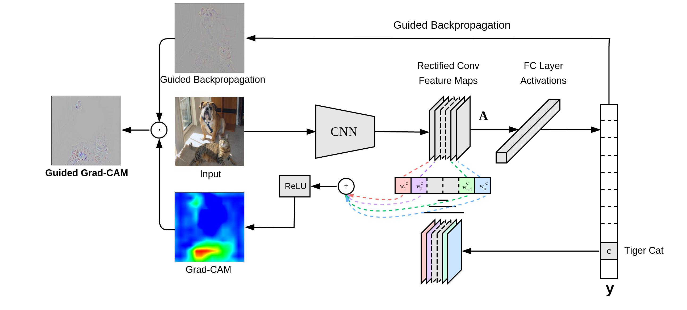
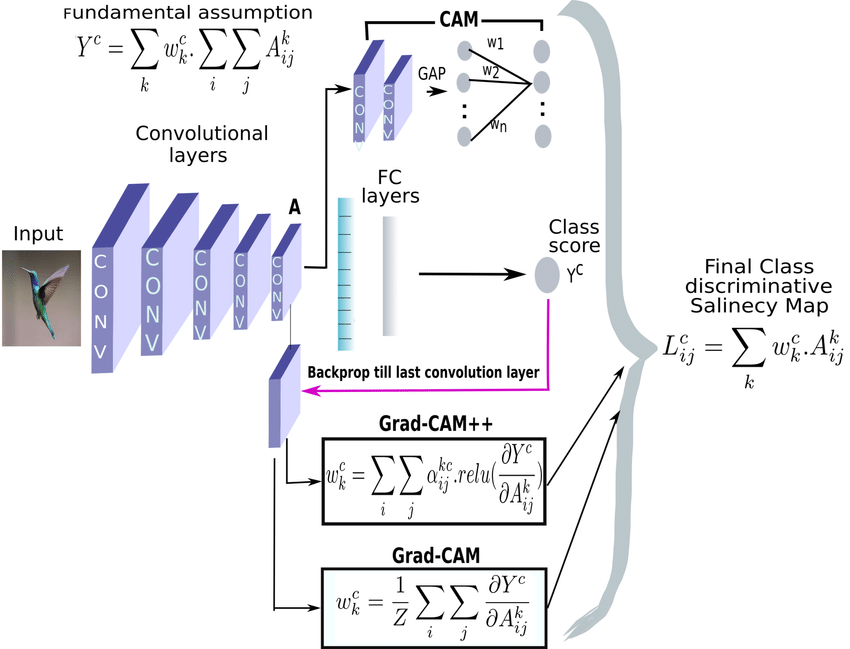
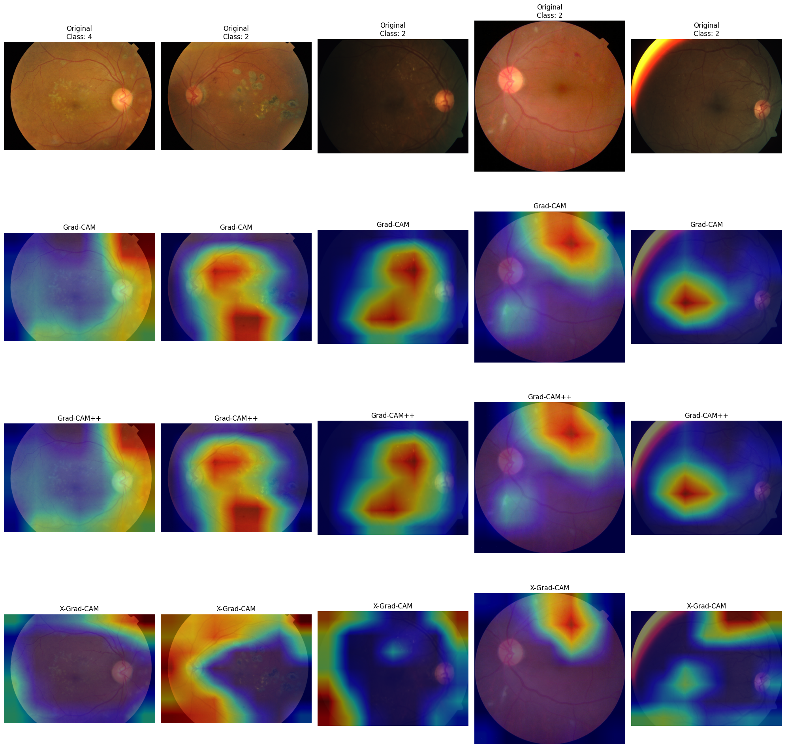
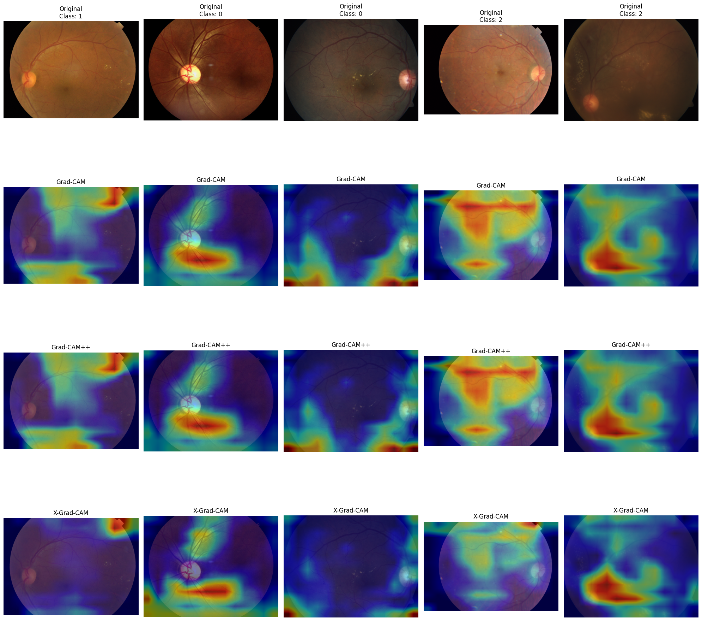

# GradCAM, GradCAM++, and XGradCAM Implementation for APTOS2019 Dataset

## Repository

https://github.com/Sladkopar/XAI-retinopathy

1. Clone this repository  
3. Place the APTOS2019 dataset[\[4\]](#references) in the `data/aptos2019/` directory  
4. Run the training in `models/` directory to fine-tune EfficientNetB0 and VGG19
5. Generate visualizations in `visualization-final.ipynb`  

## Overview
I experimented on implementation and upgrading of class activation mapping technique - GradCAM - and applied it to the APTOS2019 (diabetic retinopathy detection dataset). I've tested the implementation of GradCAM, GradCAM++ and X-GradCAM on EfficientNetB0 and VGG19 models(fine-tuned for DR detection).

## Table of Contents
- [Theoretical Background](#theoretical-background)
  - [GradCAM](#gradcam)
  - [GradCAM++](#gradcam++)
  - [XGradCAM](#xgradcam)
- [Results](#results)
- [References](#references)

## Theoretical Background

### GradCAM

"GradCAM (Gradient-weighted Class Activation Mapping) uses the gradients of any target concept (in a classification network) flowing into the final convolutional layer to produce a coarse localization map highlighting the important regions in the image for predicting the concept." [\[1\]](#references)

**Key Steps:**
1. Forward pass the image through the model and get class scores
2. Compute gradients for the class of interest using feature maps of the last convolutional layer
3. Perform global average pooling on these gradients to obtain weights
4. Compute a weighted combination of the forward activation maps using these weights
5. Apply ReLU to consider only features that have a positive influence on the class of interest

"Grad-CAM overview: Given an image and a class of interest (e.g., ‘tiger cat’ or any other type of differentiable output) as input, we forward propagate the image through the CNN part of the model and then through task-specific computations to obtain a raw score for the category. The gradients are set to zero for all classes except the desired class (tiger cat), which is set to 1. This signal is then backpropagated to the rectified convolutional feature maps of interest, which we combine to compute the coarse Grad-CAM localization (blue heatmap) which represents where the model has to look to make the particular decision. Finally, we pointwise multiply the heatmap with guided backpropagation to get Guided Grad-CAM visualizations which are both high-resolution and concept-specific."[\[1\]](#references):

Mathematically:
$$ L_{GradCAM}^c = ReLU\left(\sum_k \alpha_k^c A^k\right) $$
where $\alpha_k^c$ is the importance weight for the k-th feature map:
$$ \alpha_k^c = \frac{1}{Z} \sum_i \sum_j \frac{\partial y^c}{\partial A_{ij}^k} $$

### GradCAM++

GradCAM++ is an extension of GradCAM that consider higher-order derivatives and different weighting function.

**Improvements over GradCAM:**
1. Considers positive partial derivatives of the class score with respect to the activations
2. Uses weighted average of the gradients where weights are proportional to the gradients themselves

"An overview of all the three methods – CAM, Grad-CAM, GradCAM++ – with their respective computation expressions"[\[2\]](#references):

Mathematically:
$$ L_{GradCAM++}^c = ReLU\left(\sum_k w_k^c A^k\right) $$  
where $w_k^c$ is computed as:  
$$ w_k^c = \sum_i \sum_j \alpha_{ij}^{kc} \cdot ReLU\left(\frac{\partial y^c}{\partial A_{ij}^k}\right) $$ 
and $\alpha_{ij}^{kc}$ are weighting coefficients that capture the importance of location (i,j):
$$ \alpha_{ij}^{kc} = \frac{\frac{\partial^2 y^c}{(\partial A_{ij}^k)^2}}{2 \frac{\partial^2 y^c}{(\partial A_{ij}^k)^2} + \sum_a \sum_b A_{ab}^k \frac{\partial^3 y^c}{(\partial A_{ij}^k)^3}}$$

### X-GradCAM

X-GradCAM (Epsilon-GradCAM) is another variant that is aimed on "Sensitivity and Conservation". It introduces a small constant in the denominator to avoid division by zero to provide more stable results.

"X-GradCAM is a linear combination of feature maps, but able to meet the constraints of those two axioms (Sensitivity and Conservation)" [\[3\]](#references)

**Key Differences:**
1. Adds a small epsilon term in the denominator when computing weights
2. Should provide smoother and more stable attention maps compared to GradCAM

Mathematically:
Neuron Importance Weights:
$$ \alpha_k^c = \frac{\sum_{i,j} \left( \frac{\partial y^c}{\partial A_{ij}^k} \cdot A_{ij}^k \right)}{\sum_{i,j} A_{ij}^k + \epsilon} $$

Final Activation Map:
$$ L_{XGradCAM}^c = ReLU\left(\sum_k \alpha_k^c A^k \right) $$

## Results

I experimented with heatmaps overlayed on original images, showing which regions of the image were most influential in the model's decision. Here are some results:

Experimenting with fine-tuned EfficientNetB0 showed that:
- GradCAM can locate areas which the doctor would pay attention to (I am not a medic, but looking through the dataset one can notice features common for each class)
- GradCAM++ output is almost identical to GradCAM, it is hard to see the difference, but manual comparison of the heatmaps values showed that they are different
- X-GradCam potentially can improve the quality of the attention area which GradCAM outputs, but for some cases it locates high attention in the corners of the image where nothing is located. In my opinion, either the gradients are too small or there might be some kind of noise in the corners.

Experimenting with fine-tuned VGG19 showed that:
- Quality of all the heatmaps became better - there are sharper figures
- GradCAM++ output is still almost identical to GradCAM, but it became easier to see the difference. Both methods show high values for some image regions
- X-GradCam still locates high attention in the corners of the image where nothing is located, but it also located some regions close to GradCAM and GradCAM++ output.

## References

1. Selvaraju, R. R., et al. ["Grad-CAM: Visual Explanations from Deep Networks via Gradient-based Localization"](https://arxiv.org/abs/1610.02391)
2. Chattopadhyay, A., et al. ["Grad-CAM++: Improved Visual Explanations for Deep Convolutional Networks"](https://arxiv.org/abs/1710.11063)
3. Fu, R., et al. ["Axiom-based Grad-CAM: Towards Accurate Visualization and Explanation of CNNs"](https://arxiv.org/abs/2008.02312)
4. APTOS 2019 Blindness Detection: https://www.kaggle.com/c/aptos2019-blindness-detection